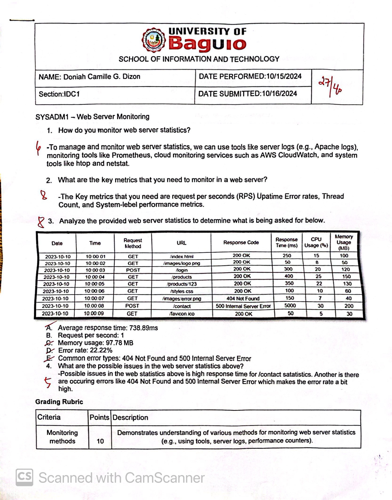

<table style="width: 100%">
  <tr>
    <td></td>
    <td style="text-align: center; font-size: 24px;">SCHOOL OF INFORMATION TECHNOLOGY</td>
    <td></td>
  </tr>
  <tr>
    <td><strong>NAME:</strong> Doniah Camille G. Dizon</td>
    <td><strong>SECTION:</strong> IDC1</td>
    <td><strong>DATE SUBMITTED:</strong></td>
  </tr>
</table>

# SYSADM1 PORTFOLIO

## Table of Contents

| **Name of Activities**                                | **Date of Activity**          | **Page No.** |
|-----------------------------------------------------|-------------------------------|--------------|
| **First Grading**                                                                                   |
| **Quizzes**                                          |                               |              |
| **Other Activities**                                 |                               |              |
| - Organizational Policies                            | 08/27/2024                    |              |
| **First Grading LAB Exam**                           |   09/18/2024                  |              |
| **First Grading LEC Exam**                           |    09/18/2024                 |              |
| **Midterms**                                         |                               |              |
| **Other Activities**                                 |                               |              |
| - Evaluating End-User Licence Agreement              | 10/01/2024                    |              |
| - Web Server Monitoring                              | 10/16/2024                    |              |
| **Midterms Exam**                                    |    10/29/2024                 |              |
| **Finals**                                           |                               |              |
| **Other Activities**                                 |                               |              |
| - Acceptable Use Policy                              | 11/05/2024                    |              |
| - Data Loss                                          |11/20/2024                     |              |
| - Capacity Planning                                  |11/26/2024                     |              |
| **Finals Exam**                                      |                               |              |

# FIRST GRADING
**Organizational Policies**

**First Grading Lab Exam**

**First Grading Lecture Exam**

# MIDTERMS
**Evaluating End-User Licence Agreement**

**Web Server Monitoring**

**Midterms Exam**

# FINALS
**Acceptable Use Policy**

**Data Loss**

**Capacity Planning**

**Course Reflection**

What were your initial expectations for the course? Did the course meet,
exceed, or fall short of these expectations?

 -I expected to learn more about managing computer systems. The course met my expectations and even exceeded them.

What were the main topics or concepts covered in the course? How did
these topics contribute to your understanding of the subject matter?

  -Some of the main topics are Data recovery, software and platform services, capacity management, Managing services in linux and windows, and may more.
  These topics provided me with understanding of the connection of each topics to each other like how this one topic will be good if I did this other topic.

Reflecting on your learning process, what were the most effective
strategies or techniques that helped you grasp and retain the course
material?

 -Researching about the lessons was most effective for me including watching videos that explain about the lessons.

Were there any particular assignments, projects, or activities that
significantly enhanced your learning experience? Why were they
effective?

-I think all the lab activities, they actually help me practice managing servers and it also adds more to my knowledge about servers.

Did you encounter any challenges or difficulties during the course? How
did you overcome these obstacles, and what did you learn from them?

-I expirienced not knowing about what our teacher was teaching, and I realize that I dont know that much about these things which made me to dig deeper by reasearching.

Did the course encourage critical thinking and analysis? How did it
promote higher-order thinking skills, such as problem-solving or
decision-making?

- Yes, because there were activities that employ real life scenarios in most of the activities that enhance problem-solving skills.

Reflecting on your personal growth, what new knowledge, skills, or
perspectives did you gain from this course?

-I gained a deeper understanding of servers, what are the appropriate policies, data recovery and many more. These will help me in managing servers and trouble shooting in the future.

How do you plan to apply what you have learned in this course to your
future studies, career, or personal life?

-I plan to apply the knowledge and skills gained from this course in my future studies by applying them to gain more knowledge. In my future career i plan to use these skills to contribute to the field I am in. On the personal level, the course helped improved my problem-solving abilities which will be good in various aspects.    
